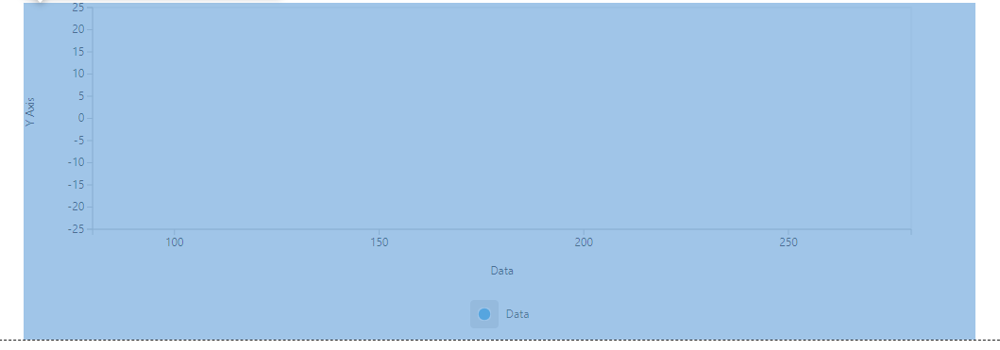

# Padding

-   [Padding](#padding)
    -   [Container Padding](#container-padding)
    -   [Content Padding](#content-padding)
    -   [JSON Properties](#json-properties)
        -   [Root](#root)
            -   [Required](#required)
        -   [Constraints](#constraints)
        -   [Default](#default)

There are 2 kinds of padding that can be applied to graphs:

1. Container Padding
2. Content Padding

## Container Padding

Consumer can add CSS padding/margin on the container of the graph whose ID is provided to Carbon's input (via JSON) for inserting the graph. Above properties applied will be used to position the graph's axis, grid, labels, legend etc.

**Example use case:** Consumer has multiple graphs and they want to position/line-up all the graphs vertically.

## Content Padding

Consumer can use the input JSON's `padding` property to position the content of the graph in the container.

**WARNING:**
Use of content-based `padding` property is strictly use-case specific. Flags such as `showLabel` and `axis.x.show` and `axis.y.show` needs to be hidden appropriately by the consumer.

**Example use case:** Consumer has their own axis and labels and wants to only make use of the content and grid lines.

### Container



### Content


## JSON Properties

### Root

#### Required

| Property Name | Expected | Description                                                                                       |
| ------------- | -------- | ------------------------------------------------------------------------------------------------- |
| `top`         | number   | Customize the top-start point of the graph content                                                |
| `bottom`      | number   | Customize the length from the bottom of content relative to bottom-end point of the graph content |
| `left`        | number   | Customize the left-start point of the graph content                                               |
| `right`       | number   | Customize the right-end point of the graph content                                                |

### Constraints

-   For some graphs like Gantt, if top padding is not properly padded, the custom dateline indicators might get cut-off.
-   Axes Labels can appear within the graph if not padded properly.
-   Axes ticks and text might get cut-off when the padding being used is too low than the default padding values.
-   Using negative values for padding is allowed, doing so, it shifts graph content more towards the padded side.

### Default

-   Internally, graphs use the following padding properties.

```javascript
var padding = {
    top: 10,
    bottom: 5,
    left: 30,
    right: 50
};
```
